# InCloud — Architecture Document

**Document Version:** 1.0  
**Last Updated:** March 6, 2026  
**Author:** Auto-generated from full codebase analysis  
**Project Owner:** Pranjal Sharma  
**Status:** Living Document

---

## Table of Contents

1. [Executive Summary](#1-executive-summary)
2. [Technology Stack](#2-technology-stack)
3. [High-Level Architecture](#3-high-level-architecture)
4. [Project Directory Structure](#4-project-directory-structure)
5. [Frontend Architecture (Next.js App Router)](#5-frontend-architecture-nextjs-app-router)
6. [Backend Architecture (Appwrite BaaS)](#6-backend-architecture-appwrite-baas)
7. [Authentication & Session Management](#7-authentication--session-management)
8. [Data Model & Schema Design](#8-data-model--schema-design)
9. [File Management Pipeline](#9-file-management-pipeline)
10. [Folder & Tag System](#10-folder--tag-system)
11. [Storage Management & Quota Engine](#11-storage-management--quota-engine)
12. [Security Architecture](#12-security-architecture)
13. [Error Handling & Resilience](#13-error-handling--resilience)
14. [UI/UX Architecture & Design System](#14-uiux-architecture--design-system)
15. [Component Architecture](#15-component-architecture)
16. [API Layer](#16-api-layer)
17. [State Management](#17-state-management)
18. [Performance Patterns](#18-performance-patterns)
19. [Infrastructure & Deployment](#19-infrastructure--deployment)
20. [Known Trade-offs & Technical Debt](#20-known-trade-offs--technical-debt)

---

## 1. Executive Summary

**InCloud** (codenamed **VFX Vault**) is a **self-hosted, single-user, private cloud file management platform** built specifically for VFX production workflows. It enables organized storage, retrieval, searching, and backup of all media types — raw footage, project files, rendered outputs, textures, audio, and archives.

### Core Philosophy

| Principle | Implementation |
|-----------|----------------|
| **Private & Autonomous** | Self-hosted on ExCloud VM; zero external SaaS dependencies |
| **Single-User Focus** | No collaboration overhead; every document scoped to one user |
| **Hybrid Organization** | Folders (hierarchy) + Tags (flat labels) working together |
| **VFX-Optimized** | Category system for video/image/audio/3D/LUT/archive/doc |
| **Integrity-First** | SHA-256 checksum on every upload; verify-on-download |
| **Resumable Uploads** | TUS protocol with localStorage tracking for network resilience |

### Architecture Class

```
┌─────────────────────────────────────────────────────────────────┐
│  Architecture Style:    Client-Heavy SPA + BaaS (Backend-as-a-Service)  │
│  Rendering Strategy:    Client-Side Rendering (CSR) via Next.js App Router │
│  Backend Model:         Appwrite (self-hosted) — no custom server code    │
│  API Routes:            2 Next.js API routes (health check, email alerts) │
│  State Management:      React Context + Component-local useState          │
│  Data Persistence:      Appwrite Databases (document DB) + Storage (files)│
└─────────────────────────────────────────────────────────────────┘
```

---

## 2. Technology Stack

### 2.1 Core Stack

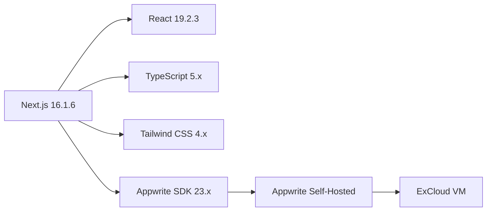

### 2.2 Detailed Dependencies

| Layer | Technology | Version | Purpose |
|-------|-----------|---------|---------|
| **Framework** | Next.js | 16.1.6 | App Router, API routes, SSR/CSR |
| **UI Library** | React | 19.2.3 | Component rendering, hooks |
| **Language** | TypeScript | ^5 | Type safety, strict mode |
| **Styling** | Tailwind CSS | ^4 | Utility-first CSS framework |
| **PostCSS** | @tailwindcss/postcss | ^4 | Build-time CSS processing |
| **Backend SDK** | appwrite (client) | ^23.0.0 | Client-side Appwrite operations |
| **Backend SDK** | node-appwrite (server) | ^22.1.3 | Server-side API route operations |
| **Fonts** | @fontsource-variable/outfit | ^5.2.8 | Display headings (self-hosted) |
| **Fonts** | @fontsource-variable/dm-sans | ^5.2.8 | Body text (self-hosted) |
| **Linting** | ESLint + eslint-config-next | ^9 / 16.1.6 | Code quality, Next.js rules |

### 2.3 Zero External Runtime Dependencies

The project uses **no** state management libraries (Zustand, Redux), **no** form libraries (React Hook Form), **no** UI component libraries (Radix, Headless UI), and **no** utility libraries (date-fns, clsx, axios). All logic is hand-written using:

- Native `fetch` API
- `crypto.subtle` (Web Crypto API)
- `localStorage` for upload resume
- `sessionStorage` for UI state (health banner dismissal)
- React Context for global state
- CSS custom properties for theming

---

## 3. High-Level Architecture

### 3.1 System Architecture Diagram

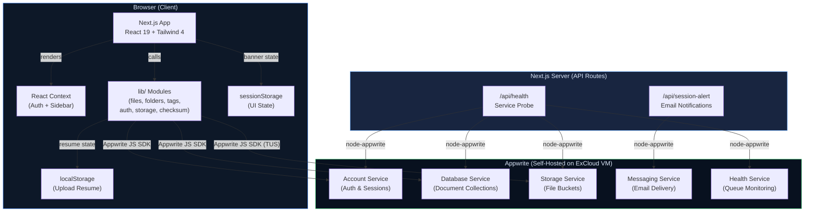

### 3.2 Request Flow

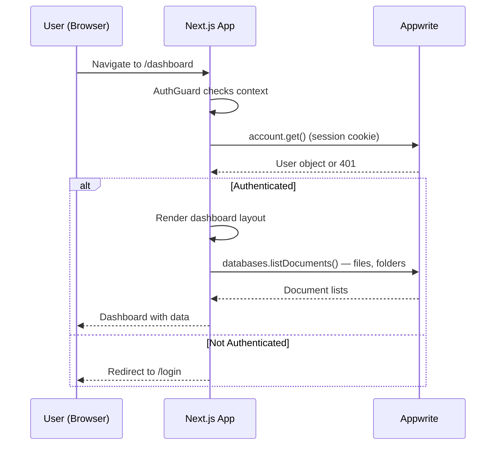

---

## 4. Project Directory Structure

```
incloud/
├── app/                          # Next.js App Router (Pages & Layouts)
│   ├── layout.tsx                # Root layout: AuthProvider, fonts, metadata
│   ├── page.tsx                  # "/" → redirect to /dashboard
│   ├── error.tsx                 # Global error boundary
│   ├── globals.css               # CSS vars, theme tokens, animations
│   ├── (auth)/                   # Route group: public auth pages
│   │   ├── layout.tsx            # Auth layout (no sidebar)
│   │   ├── login/page.tsx        # /login — LoginForm
│   │   └── register/page.tsx     # /register — RegisterForm
│   ├── (dashboard)/              # Route group: protected dashboard
│   │   ├── layout.tsx            # Dashboard shell: AuthGuard + Sidebar + TopBar
│   │   ├── error.tsx             # Dashboard-level error handler
│   │   └── dashboard/
│   │       ├── page.tsx          # /dashboard — overview, widgets, recent files
│   │       ├── files/page.tsx    # /dashboard/files — all files, uploads
│   │       ├── folders/page.tsx  # /dashboard/folders — folder CRUD
│   │       ├── search/page.tsx   # /dashboard/search — full-text + filters
│   │       ├── settings/page.tsx # /dashboard/settings — preferences
│   │       └── backup/page.tsx   # /dashboard/backup — backup vault
│   ├── api/
│   │   ├── health/route.ts       # GET: 6-service health probe
│   │   └── session-alert/route.ts# POST: login/register email alerts
│   └── statusofapp/page.tsx      # Public service status dashboard
│
├── components/
│   ├── auth/                     # Authentication UI
│   │   ├── AuthSplitPanel.tsx    # Two-column auth layout
│   │   ├── LoginForm.tsx         # Email/password login form
│   │   └── RegisterForm.tsx      # Registration with strength meter
│   ├── dashboard/                # Dashboard UI
│   │   ├── FileCard.tsx          # Single file (grid card / list row)
│   │   ├── FileGrid.tsx          # File list with sorting & view toggle
│   │   ├── FileManager.tsx       # File operations: preview, rename, move, delete
│   │   ├── FolderCard.tsx        # Single folder card with stats
│   │   ├── Sidebar.tsx           # Navigation sidebar with storage mini-bar
│   │   ├── StorageBar.tsx        # Animated progress bar (color-coded)
│   │   ├── StorageWidget.tsx     # Vault + Backup usage overview
│   │   ├── TopBar.tsx            # Header: search, breadcrumbs, user menu
│   │   └── UploadZone.tsx        # Drag-drop uploader with progress tracking
│   ├── system/                   # Platform infrastructure UI
│   │   ├── AppwritePing.tsx      # Silent backend connectivity probe
│   │   ├── AuthGuard.tsx         # Route protection (redirect if unauthenticated)
│   │   ├── ErrorBoundary.tsx     # React error boundary with fallback UI
│   │   ├── HealthBanner.tsx      # Service disruption alert bar
│   │   └── MobileBlock.tsx       # Desktop-only viewport gate (≥1024px)
│   └── ui/                       # Reusable primitives
│       ├── Badge.tsx             # Color-variant label badge
│       ├── CloudBackground.tsx   # Animated SVG auth background
│       ├── FileTypeIcon.tsx      # Category-based file icons (8 types)
│       ├── FormInput.tsx         # Accessible form input with validation
│       ├── InCloudLogo.tsx       # Branded logo (light/dark variants)
│       └── Modal.tsx             # Overlay dialog with keyboard support
│
├── lib/                          # Core business logic (no UI)
│   ├── appwrite.ts               # Appwrite SDK client singleton
│   ├── auth.ts                   # Register, login, logout, profile CRUD
│   ├── auth-context.tsx          # React AuthProvider + useAuth hook
│   ├── checksum.ts               # SHA-256 hashing (Web Crypto API)
│   ├── config.ts                 # Resource IDs, capacity constants
│   ├── files.ts                  # File CRUD, search, upload, download URLs
│   ├── folders.ts                # Folder CRUD, stats, seeding defaults
│   ├── format.ts                 # Human-readable bytes, dates, duration
│   ├── retry.ts                  # Exponential backoff with jitter
│   ├── session-alert.ts          # Fire-and-forget session email trigger
│   ├── settings.ts               # User preferences CRUD
│   ├── sidebar-context.tsx       # Sidebar collapse state provider
│   ├── storage-stats.ts          # Quota tracking, recalculation
│   ├── tags.ts                   # Tag CRUD + default seeding
│   ├── types.ts                  # TypeScript interfaces, MIME→category map
│   └── upload-resume.ts          # localStorage-backed TUS resume registry
│
├── scripts/
│   └── update-bucket.mjs         # One-time bucket config (1GB limit, all types)
│
├── public/                       # Static assets
├── appwrite.config.json          # Appwrite project settings snapshot
├── analysis.md                   # Bug audit log (16 fixed, 3 noted)
├── VFX_Vault_PRD.md              # Product Requirements Document
├── VFX_Vault_TRD.md              # Technical Requirements Document
├── package.json                  # Dependencies & scripts
├── tsconfig.json                 # TypeScript strict config
├── next.config.ts                # Next.js config (minimal)
├── postcss.config.mjs            # PostCSS with Tailwind plugin
└── eslint.config.mjs             # ESLint with Next.js core-web-vitals
```

---

## 5. Frontend Architecture (Next.js App Router)

### 5.1 Routing Architecture

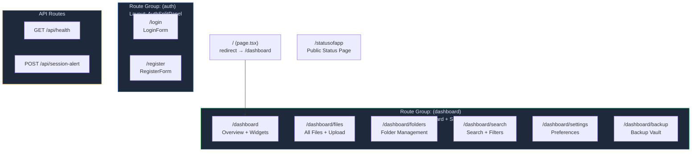

### 5.2 Layout Nesting

```
Root Layout (app/layout.tsx)
├── <html lang="en">
│   ├── Fonts: Outfit (display) + DM Sans (body)
│   ├── <AuthProvider>                ← Global auth context
│   │   ├── <AppwritePing />         ← Silent connectivity check
│   │   └── {children}
│   │       ├── (auth) Layout        ← AuthSplitPanel wrapper (no sidebar)
│   │       │   ├── /login
│   │       │   └── /register
│   │       │
│   │       ├── (dashboard) Layout   ← Protected shell
│   │       │   ├── <AuthGuard>      ← Redirects if !user
│   │       │   ├── <MobileBlock />  ← Viewport gate (≥1024px)
│   │       │   ├── <SidebarProvider>
│   │       │   │   ├── <Sidebar />
│   │       │   │   ├── <TopBar />
│   │       │   │   ├── <HealthBanner />
│   │       │   │   └── <ErrorBoundary>
│   │       │   │       └── {page content}
│   │       │   │
│   │       ├── /statusofapp         ← No layout wrapper (public)
│   │       └── /                    ← Redirect to /dashboard
```

### 5.3 Route Groups Explained

| Group | URL Prefix | Layout | Auth | Purpose |
|-------|-----------|--------|------|---------|
| `(auth)` | None | AuthSplitPanel (light theme, two-column) | Public | Login & Registration |
| `(dashboard)` | None | Sidebar + TopBar + AuthGuard (dark theme) | Protected | All dashboard pages |
| `/api/*` | `/api` | None (serverless) | Varies | Backend proxy endpoints |
| `/statusofapp` | Direct | Root only | Public | Service status dashboard |

---

## 6. Backend Architecture (Appwrite BaaS)

### 6.1 Appwrite Services Used

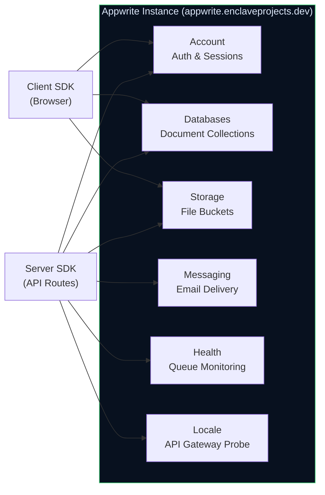

### 6.2 SDK Configuration

```
Client SDK (lib/appwrite.ts):
  Endpoint: https://appwrite.enclaveprojects.dev/v1
  Project:  incloud-enclaveprojects
  Exports:  client, account, databases, storage (singletons)
  Auth:     Session cookie (browser-managed)

Server SDK (API routes):
  Same endpoint + project
  + APPWRITE_API_KEY for privileged operations
  Used in: /api/health (health probes), /api/session-alert (email sending)
```

### 6.3 Database & Collection IDs

| Resource | ID | Purpose |
|----------|-----|---------|
| **Database** | `incloud_db` | Single database for all collections |
| **Collection** | `files` | VaultFile documents (file metadata) |
| **Collection** | `folders` | VaultFolder documents (folder hierarchy) |
| **Collection** | `tags` | VaultTag documents (label definitions) |
| **Collection** | `storage_metadata` | Per-user quota tracking |
| **Collection** | `settings` | Per-user preferences |
| **Collection** | `user_profiles` | User profile data |

### 6.4 Storage Buckets

| Bucket ID | Purpose | Max File Size | Allowed Types |
|-----------|---------|---------------|---------------|
| `vault-files` | Primary file storage | 1 GB | All (configured via script) |
| `thumbnails` | Generated thumbnails | Default | Image types |

---

## 7. Authentication & Session Management

### 7.1 Authentication Flow Diagram

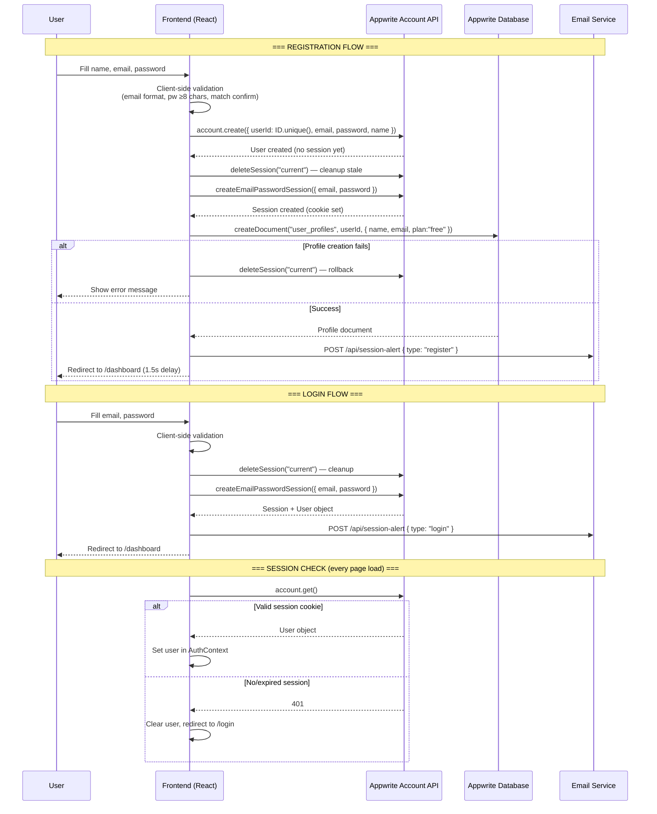

### 7.2 Session Configuration (from appwrite.config.json)

| Setting | Value | Meaning |
|---------|-------|---------|
| Session Duration | 31,536,000 sec (365 days) | Sessions last 1 year |
| Sessions Limit | 10 | Max 10 concurrent sessions per user |
| Password History | 0 | No password reuse restriction |
| Auth Methods Enabled | email-password, JWT, phone, anonymous, email-OTP, magic-url, invites | All methods active (only email-password used) |

### 7.3 Password Strength Validation

The registration form computes a real-time password strength score (0–5):

| Check | Points |
|-------|--------|
| Length ≥ 8 characters | +1 |
| Length ≥ 12 characters | +1 |
| Contains uppercase letter | +1 |
| Contains number | +1 |
| Contains special character | +1 |

| Score | Label | Color |
|-------|-------|-------|
| 0–1 | Weak | Red |
| 2–3 | Fair | Amber |
| 4–5 | Strong | Green |

### 7.4 Session Alert Emails

After every successful login or registration, a fire-and-forget `POST /api/session-alert` is sent. The server-side API route:

1. Validates the user exists via `users.get(userId)` (server SDK)
2. Builds a branded HTML email with:
   - Activity type (login vs. registration)
   - Timestamp (Asia/Kolkata timezone)
   - Device info (User-Agent header)
   - Security warning for unauthorized sessions
3. Sends via Appwrite Messaging service
4. All user-controlled values are HTML-escaped to prevent XSS

---

## 8. Data Model & Schema Design

### 8.1 Entity Relationship Diagram

```mermaid
erDiagram
    USER_PROFILE ||--o{ VAULT_FILE : "owns"
    USER_PROFILE ||--o{ VAULT_FOLDER : "owns"
    USER_PROFILE ||--o{ VAULT_TAG : "owns"
    USER_PROFILE ||--|| STORAGE_METADATA : "has"
    USER_PROFILE ||--|| USER_SETTINGS : "has"
    VAULT_FOLDER ||--o{ VAULT_FILE : "contains"
    VAULT_FILE }o--o{ VAULT_TAG : "tagged with (JSON array)"

    USER_PROFILE {
        string user_id PK "Appwrite Account $id"
        string name
        string email
        string registered_at "ISO 8601"
        number storage_used "bytes"
        string plan "free | pro | enterprise"
    }

    VAULT_FILE {
        string $id PK "Appwrite document ID"
        string user_id FK "Owner"
        string filename "Current display name"
        string original_filename "Name at upload"
        number file_size "bytes"
        string mime_type
        string appwrite_file_id FK "Storage bucket ref"
        string folder_id FK "Parent folder"
        string folder_path "Display breadcrumb"
        string tags "JSON stringified array"
        boolean is_backup
        string backup_date "ISO | null"
        string upload_date "ISO"
        string modification_date "ISO"
        string resolution "e.g. 1920x1080"
        number duration "seconds"
        string codec
        number bitrate "kbps"
        string color_space
        number frame_rate "fps"
        string category "FileCategory enum"
        string extension "lowercase"
        string thumbnail_file_id "Storage ref"
        string checksum "SHA-256 hex"
    }

    VAULT_FOLDER {
        string $id PK
        string user_id FK
        string folder_name
        string parent_folder_id FK
        string full_path "e.g. /Raw_Footage/Shots"
        string color "hex code"
        string created_date "ISO"
    }

    VAULT_TAG {
        string $id PK
        string user_id FK
        string tag_name
        string color "hex"
        string category "status | quality | project | type | format"
        string created_date "ISO"
    }

    STORAGE_METADATA {
        string $id PK
        string user_id FK
        number total_vault_size "bytes"
        number total_backup_size "bytes"
        number max_vault_capacity "40 GB"
        number max_backup_capacity "10 GB"
        number file_count
        number backup_file_count
        string last_updated "ISO"
    }

    USER_SETTINGS {
        string $id PK
        string user_id FK
        string theme "dark | light"
        string default_view "grid | list"
        boolean auto_backup
        boolean compression
        number warning_threshold "0-100 percent"
        string video_quality "720p | 1080p | 4K"
        boolean show_exif
        number hls_threshold_mb "default 500"
    }
```

### 8.2 FileCategory Classification

Files are categorized automatically on upload based on MIME type and extension:

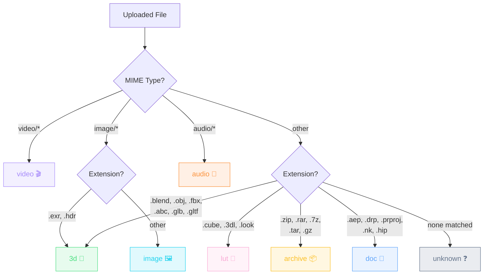

### 8.3 Tag Storage Pattern

Tags are stored as a **JSON-stringified array** in the `tags` field of each file document:

```
Database:  '["4K", "in-progress", "project-atlas"]'   (string)
Parsed:    ["4K", "in-progress", "project-atlas"]      (string[])
```

- **Server-side filtering:** Not directly supported (Appwrite can't query inside JSON strings)
- **Client-side filtering:** After fetch, `parseVaultFile()` parses JSON → array; filter by set membership
- **Tag definitions** live in the `tags` collection (name + color + category) but files reference tags by **name**, not by document ID — this is a soft reference pattern

---

## 9. File Management Pipeline

### 9.1 Upload Pipeline

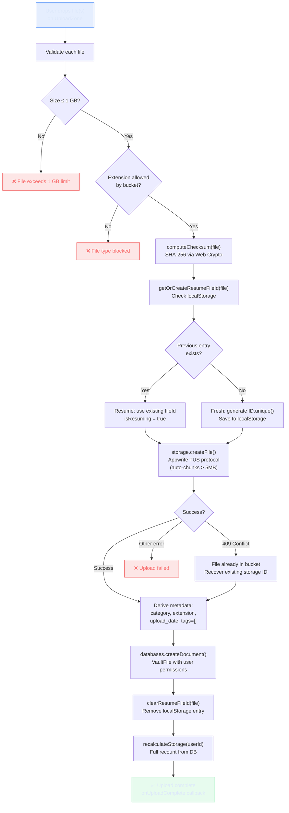

### 9.2 Upload Resume Strategy

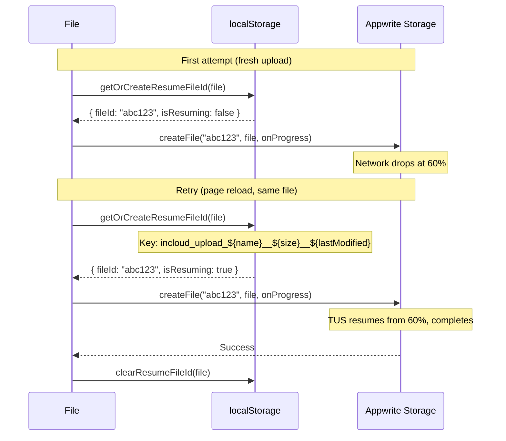

**Key design decisions:**
- localStorage key combines `name + size + lastModified` for fingerprinting
- Stale entries auto-expire after **7 days**
- `cleanupStaleResumeEntries()` runs on app init
- SSR-safe: returns fresh ID if `window` is undefined

### 9.3 File Integrity Verification

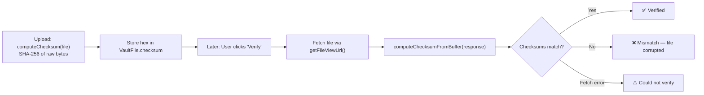

### 9.4 File Operations Summary

| Operation | Function | API Calls | Side Effects |
|-----------|----------|-----------|--------------|
| **Upload** | `uploadFile()` | `storage.createFile` + `databases.createDocument` | Checksum, resume tracking, storage recalc |
| **List** | `listFiles()` | `databases.listDocuments` (paginated) | Parses tags JSON |
| **Recent** | `listRecentFiles()` | `databases.listDocuments` (limit, descending) | — |
| **Search** | `searchFiles()` | `databases.listDocuments` + `Query.search` | Client-side tag filtering |
| **Rename** | `updateFile()` | `databases.updateDocument` | Updates `modification_date` |
| **Move** | `updateFile()` | `databases.updateDocument` | Updates `folder_id` + `folder_path` |
| **Toggle Backup** | `toggleBackup()` | `databases.updateDocument` + `updateBackupStats()` | Sets/clears `backup_date` |
| **Delete** | `deleteFile()` | `storage.deleteFile` + `databases.deleteDocument` | Best-effort storage cleanup; DB is priority |
| **Download** | `getFileDownloadUrl()` | URL construction | Opens in new tab |
| **Preview** | `getFileViewUrl()` | URL construction | Inline display (images/video/audio) |
| **Verify** | `verifyFileIntegrity()` | `fetch` + `computeChecksumFromBuffer` | Compares with stored checksum |

---

## 10. Folder & Tag System

### 10.1 Folder Hierarchy

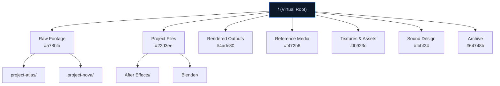

**7 default folders** seeded on first login via `seedDefaultFolders(userId)`. Nested folders supported to unlimited depth with breadcrumb paths (e.g., `/Raw_Footage/project-atlas`).

### 10.2 Folder Operations

| Operation | Behavior |
|-----------|----------|
| **Create** | Sets `full_path = parentPath/folder_name` (spaces → underscores) |
| **Rename** | Recomputes `full_path` from parent + new name |
| **Delete** | First unlinks all child files (sets `folder_id=""`, `folder_path="/"`), then deletes folder |
| **List Children** | `Query.equal("parent_folder_id", folderId)` |
| **Stats** | Per-folder `fileCount` and `totalSize` via parallel queries |

### 10.3 Default Tag Taxonomy

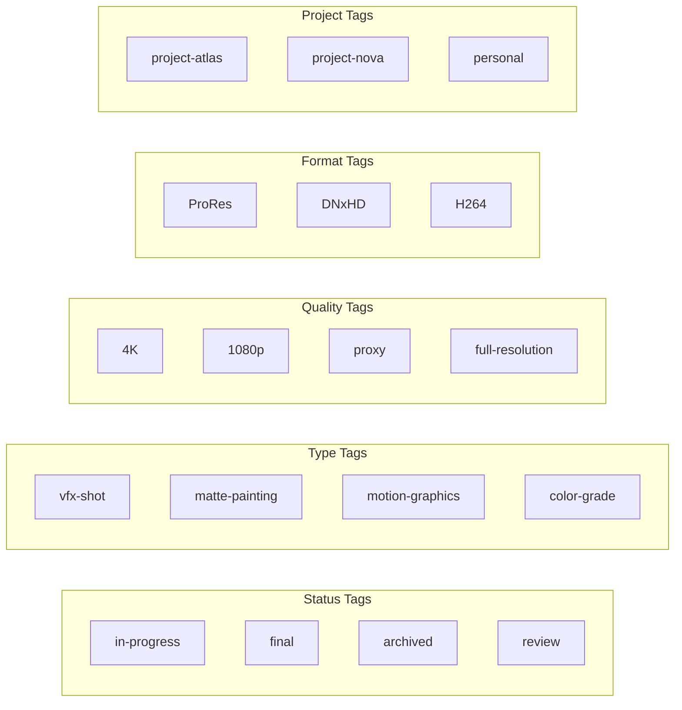

**18 default tags** seeded via `seedDefaultTags(userId)` across 5 categories. Users can create unlimited custom tags with custom colors.

---

## 11. Storage Management & Quota Engine

### 11.1 Quota Architecture

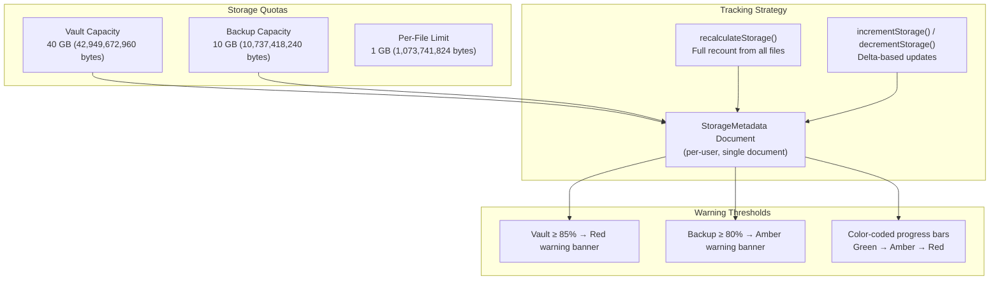

### 11.2 Storage Recalculation (Authoritative)

After uploads complete, `recalculateStorage(userId)` performs a full recount:

1. Paginated fetch of **all** files (100 per batch)
2. Sum `file_size` for all files → `total_vault_size`
3. Filter `is_backup === true`, sum → `total_backup_size`
4. Count totals → `file_count`, `backup_file_count`
5. Update the `storage_metadata` document

This eliminates counter drift from concurrent uploads (a race condition that was previously fixed — see `analysis.md`).

### 11.3 Storage Bar Color Algorithm

```
if percent >= 85% → Red (#ef4444)
if percent >= 70% → Amber (#f59e0b)
otherwise         → Blue (#3b82f6)
```

Note: The StorageBar component uses a slightly different threshold (≤50% green, ≤75% amber, >75% red) while the StorageWidget uses the lib function.

---

## 12. Security Architecture

### 12.1 Security Model Overview

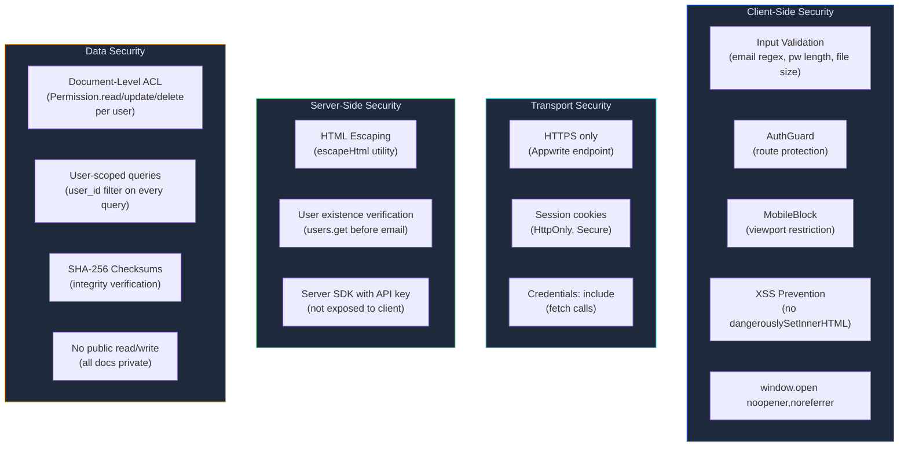

### 12.2 Permission Model

Every user-owned document is created with explicit permissions:

```typescript
permissions: [
  Permission.read(Role.user(userId)),
  Permission.update(Role.user(userId)),
  Permission.delete(Role.user(userId)),
]
```

**This means:**
- Only the owning user can read, update, or delete their documents
- No public access, no team access, no other-user access
- Appwrite enforces this at the database level
- Even if someone obtains a document ID, they cannot access it without the owner's session

### 12.3 Security Measures Applied

| Threat | Mitigation | Status |
|--------|-----------|--------|
| **XSS in email templates** | `escapeHtml()` on all user-controlled values | ✅ Fixed |
| **Unauthenticated email endpoint** | Validates user exists; returns 200 on failure (no info leak) | ⚠️ Noted |
| **Race condition (storage counters)** | Full `recalculateStorage()` replaces increment | ✅ Fixed |
| **Orphaned files on folder delete** | Batch-clear `folder_id` on children before delete | ✅ Fixed |
| **Partial registration (account without profile)** | Session rollback on profile creation failure | ✅ Fixed |
| **Tab-nabbing via window.open** | `noopener,noreferrer` flags | ✅ Fixed |
| **Orphaned bucket files** | `console.warn` with file ID for audit trail | ✅ Logged |
| **Client-side injection** | No `dangerouslySetInnerHTML`; React auto-escapes | ✅ By design |
| **CSRF** | Appwrite session cookies with SameSite policy | ✅ By framework |
| **Password brute-force** | Rate limit detection (429) with user message | ✅ Client-side |

### 12.4 Known Security Considerations

1. **Session alert endpoint is unauthenticated** — accepts `userId` from request body. Mitigated by: user existence check, no data exposure, fire-and-forget only triggers emails.
2. **API key is server-only** — `APPWRITE_API_KEY` used only in Next.js API routes, never exposed to client bundle.
3. **All `NEXT_PUBLIC_*` vars** are safe to expose (project ID, endpoint, resource IDs).

---

## 13. Error Handling & Resilience

### 13.1 Error Handling Architecture

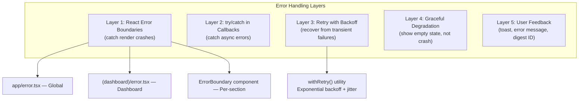

### 13.2 Retry Strategy

```
Attempt 1: 500ms  + random jitter (0-10%)
Attempt 2: 1000ms + random jitter
Attempt 3: 2000ms + random jitter (capped at 10,000ms)
```

**Non-retryable error codes** (thrown immediately):
- `400` Bad Request
- `401` Unauthorized
- `403` Forbidden
- `404` Not Found
- `409` Conflict (except in file upload — handled specially)

### 13.3 Error Boundary Cascade

```
Global Error Boundary (app/error.tsx)
├── Catches unhandled errors at app level
├── Shows error digest ID + retry / go-to-dashboard buttons
│
└── Dashboard Error Boundary (app/(dashboard)/error.tsx)
    ├── Catches errors within dashboard pages
    ├── Less intrusive UI (centered card)
    │
    └── Per-Section ErrorBoundary (components/system/ErrorBoundary.tsx)
        ├── Wraps: UploadZone, FileManager, etc.
        ├── Shows inline error with retry / reload buttons
        └── Logs with label for debugging
```

### 13.4 Degradation Patterns

| Scenario | Behavior |
|----------|----------|
| Appwrite unreachable | AppwritePing silently fails; HealthBanner shows warning bar |
| File list fetch fails | Empty state shown (no crash); error logged to console |
| Upload network drop | TUS resume available; progress preserved in localStorage |
| Storage file delete fails | Database record still deleted; orphan logged for audit |
| Email send fails | Silently swallowed; auth flow not blocked |
| Session expired mid-use | AuthGuard detects on next Context refresh; redirects to /login |

---

## 14. UI/UX Architecture & Design System

### 14.1 Theme System

The application uses **CSS custom properties** for theming, defined in `globals.css`:

#### Auth Pages (Light Theme)
```css
--ic-navy: #0D1B2A      /* Brand navy */
--ic-blue: #2563EB       /* Primary action */
--ic-surface: #FFFFFF    /* Card backgrounds */
--ic-bg: #F1F5F9         /* Page background */
--ic-text: #0F172A       /* Primary text */
```

#### Dashboard (Dark Theme — Default)
```css
--dash-bg: #08111f           /* Page background */
--dash-sidebar: #040c18      /* Sidebar background */
--dash-surface: #0d1828      /* Card/panel background */
--dash-surface-2: #182540    /* Input/nested background */
--dash-border: rgba(255,255,255,0.065)
--dash-text: #dde8fa         /* Primary text */
--dash-text-2: #7b9abf       /* Secondary text */
--dash-text-3: #3d5a7e       /* Tertiary text */
--dash-accent: #3b82f6       /* Blue accent */
```

#### File Type Colors
```css
--ft-video: #a78bfa    /* Purple */
--ft-image: #22d3ee    /* Cyan */
--ft-audio: #fb923c    /* Orange */
--ft-3d: #4ade80       /* Green */
--ft-doc: #60a5fa      /* Blue */
--ft-archive: #fbbf24  /* Amber */
--ft-lut: #f9a8d4      /* Pink */
--ft-unk: #64748b      /* Slate */
```

### 14.2 Typography

| Role | Font | Weight | Usage |
|------|------|--------|-------|
| Display / Headings | Outfit Variable | 600 | Page titles, logo, modal headers |
| Body / UI | DM Sans Variable | 400-600 | Text, buttons, labels, inputs |

Both fonts are **self-hosted** via `@fontsource-variable` packages (no Google Fonts dependency).

### 14.3 Animation System

| Animation | Duration | Effect | Usage |
|-----------|----------|--------|-------|
| `fade-up` | 0.55s | Translate Y + opacity | Page entries, modal open |
| `float-slow` | 8s | Y-axis drift | Auth background nodes |
| `float-medium` | 11s | XY drift | Auth background nodes |
| `pulse-glow` | 4s | Scale pulse | Auth background glow |
| `grid-drift` | 28s | Continuous horizontal | Auth background grid |
| `spin` | 0.8s | 360° rotation | Loading spinners |

### 14.4 Responsive Strategy

| Breakpoint | Behavior |
|-----------|----------|
| `< 1024px` | **MobileBlock** — full-screen overlay blocking access |
| `≥ 1024px` | Desktop layout: sidebar + main content |
| Auth pages | Responsive split panel (two-column on lg, single on mobile) |

The application is **desktop-only** for the dashboard. Auth pages are responsive.

### 14.5 Dashboard Layout

```
┌─────────────────────────────────────────────────────┐
│                     TopBar                          │
│  [≡ Logo] [Breadcrumbs/Title] [Search] [↑] [🔔] [👤]│
├───────────┬─────────────────────────────────────────┤
│           │                                         │
│  Sidebar  │         Main Content Area              │
│  (248px)  │                                         │
│           │   ┌─────────────────────────────────┐  │
│  Dashboard│   │  Page-specific content          │  │
│  All Files│   │  (wrapped in ErrorBoundary)      │  │
│  Folders  │   │                                  │  │
│  Search   │   │  File grids, upload zones,       │  │
│  Backup   │   │  search results, settings, etc.  │  │
│           │   └─────────────────────────────────┘  │
│  ─────── │                                         │
│  Quick    │         HealthBanner (when down)        │
│  Folders  │                                         │
│  ─────── │                                         │
│  Storage% │                                         │
│  ─────── │                                         │
│  Settings │                                         │
│  Sign Out │                                         │
│           │                                         │
└───────────┴─────────────────────────────────────────┘
```

---

## 15. Component Architecture

### 15.1 Component Hierarchy Tree

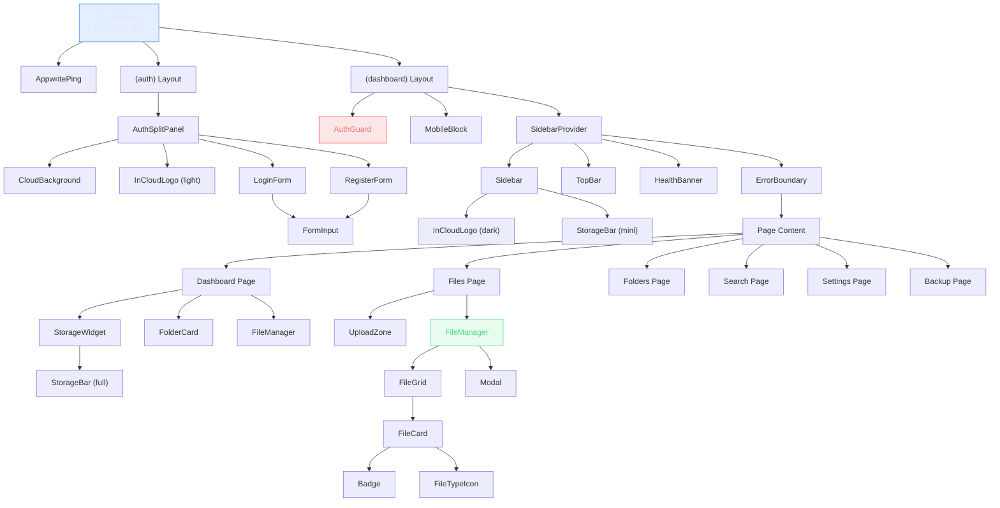

### 15.2 Component Categories

| Category | Components | Purpose |
|----------|-----------|---------|
| **Auth** (3) | AuthSplitPanel, LoginForm, RegisterForm | Authentication UI and forms |
| **Dashboard** (8) | FileCard, FileGrid, FileManager, FolderCard, Sidebar, StorageBar, StorageWidget, TopBar, UploadZone | Core application UI |
| **System** (5) | AppwritePing, AuthGuard, ErrorBoundary, HealthBanner, MobileBlock | Infrastructure / protection |
| **UI** (6) | Badge, CloudBackground, FileTypeIcon, FormInput, InCloudLogo, Modal | Reusable primitives |

### 15.3 Key Component Responsibilities

**FileManager** — The most complex component, handles:
- File preview (images, video, audio inline; others metadata-only)
- Rename dialog with auto-focus input
- Move-to-folder selection
- Tag management (add, remove, create new tags)
- Delete confirmation
- File integrity verification (SHA-256 checksum compare)
- Download (opens file URL in new tab)

**UploadZone** — Manages the full upload lifecycle:
- Drag-and-drop file selection
- File size validation (1 GB limit)
- Extension validation against bucket config
- Progress tracking per file (0-100%)
- Resume detection (shows "Resuming" badge)
- Error display per file
- Stale resume entry cleanup on mount

---

## 16. API Layer

### 16.1 Next.js API Routes

The application has only **2 server-side API routes** — all other communication goes directly from the browser to Appwrite.

#### `GET /api/health`

Probes **6 Appwrite services** in parallel and returns an aggregate status:

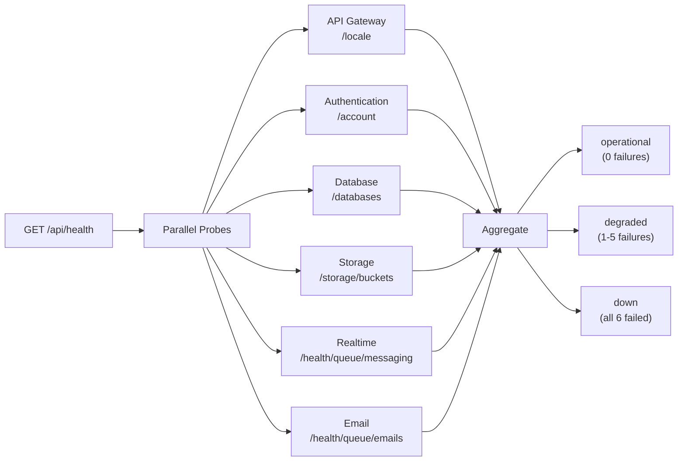

**Key logic:** HTTP 401/403 counts as "operational" (service is responding, just unauthorized). Only 5xx or network errors = "down".

#### `POST /api/session-alert`

Sends branded HTML email notifications for login/register events:
- Validates user exists via server SDK `users.get(userId)`
- Builds HTML email (dark theme, branded InCloud template)
- Sends via Appwrite Messaging
- HTML-escapes all user-controlled values to prevent XSS
- Returns `{ ok: true }` — never blocks auth flow

### 16.2 Client ↔ Appwrite Direct Communication

All data operations bypass the Next.js server:

```
Browser → Appwrite JS SDK → Appwrite REST API → Database/Storage
```

This means:
- No Next.js server middleware for data
- Authentication via browser-scoped session cookies
- File uploads go directly to Appwrite Storage (TUS protocol)
- Real-time subscriptions available (Appwrite realtime) though not yet implemented

---

## 17. State Management

### 17.1 State Architecture

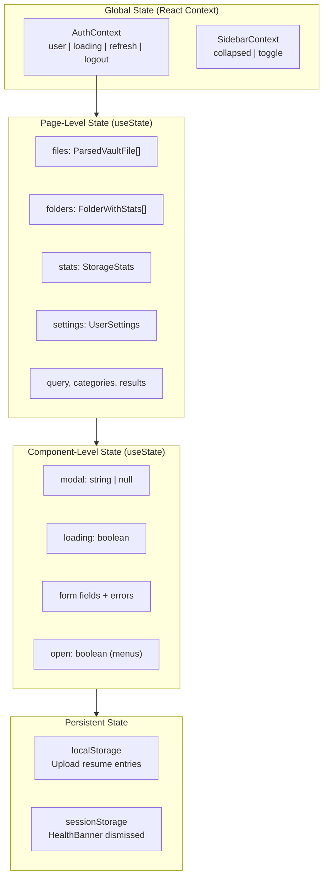

### 17.2 Data Fetching Pattern

Every page follows the same pattern:

```typescript
// 1. Get user from context
const { user } = useAuth();

// 2. Define fetch callback
const loadData = useCallback(async () => {
  if (!user) return;
  const result = await listFiles(user.$id, { limit: 50 });
  setFiles(result.files);
}, [user]);

// 3. Fetch on mount
useEffect(() => { loadData(); }, [loadData]);

// 4. Re-fetch after mutations
const handleMutate = () => loadData();
```

### 17.3 No External State Libraries

The project deliberately avoids Zustand, Redux, or any state library. Reasons:
- Single-user app with simple data flows
- No complex derived state
- Context + local state is sufficient
- Fewer dependencies = smaller bundle

---

## 18. Performance Patterns

### 18.1 Current Optimizations

| Pattern | Implementation |
|---------|---------------|
| **Parallel Promises** | `Promise.all()` for folder stats, simultaneous API calls |
| **Debounced Search** | 300ms debounce on search input (prevents per-keystroke queries) |
| **Client-Side Sort** | Sorting done in-memory (avoids re-fetching) |
| **Chunked Uploads** | Appwrite TUS auto-chunks files > 5MB |
| **Incremental Progress** | Upload progress callback updates UI per chunk |
| **Self-Hosted Fonts** | Zero external font requests (Fontsource packages) |
| **Conditional Loading** | Folders/tags loaded only when needed (not eagerly) |
| **CSS Custom Properties** | Theme changes without re-render |

### 18.2 Known Performance Considerations

| Issue | Impact | Status |
|-------|--------|--------|
| N+1 queries for folder stats | 1 query per folder (7 default) | Accepted; parallel `Promise.all()` |
| Client-side tag filtering | Fetches all files, then filters | Appwrite limitation (no JSON field query) |
| Full storage recalculation | Paginated scan of all files after upload | Accuracy > speed trade-off |
| No server-side rendering for data | All CSR — no ISR/SSG/streaming | Acceptable for single-user app |

---

## 19. Infrastructure & Deployment

### 19.1 Infrastructure Overview

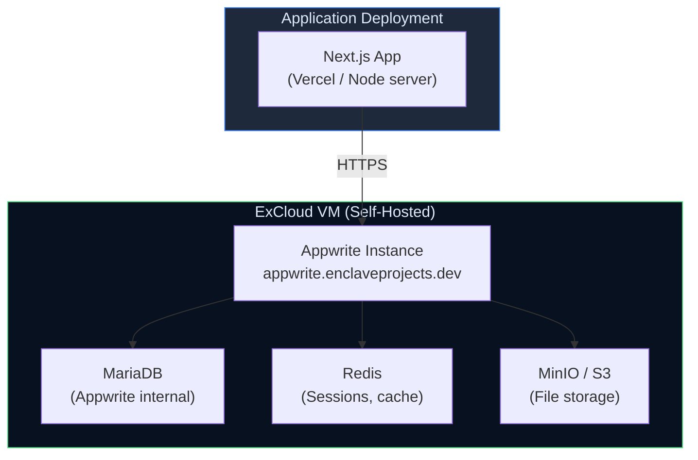

### 19.2 Appwrite Project Configuration

```json
{
  "projectId": "incloud-enclaveprojects",
  "projectName": "inCloud",
  "services": {
    "account": true,
    "databases": true,
    "storage": true,
    "messaging": true,
    "health": true,
    "functions": true,
    "teams": true
  }
}
```

### 19.3 Build & Development

| Command | Purpose |
|---------|---------|
| `npm run dev` | Start Next.js development server |
| `npm run build` | Production build |
| `npm run start` | Start production server |
| `npm run lint` | Run ESLint |
| `APPWRITE_API_KEY=xxx node scripts/update-bucket.mjs` | One-time bucket configuration |

### 19.4 Environment Variables

| Variable | Scope | Purpose |
|----------|-------|---------|
| `NEXT_PUBLIC_APPWRITE_ENDPOINT` | Public | Appwrite API URL |
| `NEXT_PUBLIC_APPWRITE_PROJECT` | Public | Project ID |
| `APPWRITE_API_KEY` | Server-only | Privileged API access (API routes) |

---

## 20. Known Trade-offs & Technical Debt

### 20.1 Architectural Decisions & Rationale

| Decision | Trade-off | Rationale |
|----------|-----------|-----------|
| **Client-side rendering only** | No SEO, slower initial load | Single-user private app; SEO irrelevant |
| **Direct Appwrite SDK calls** | No abstraction layer / caching | Simplicity; Appwrite handles auth/permissions |
| **JSON-stringified tags** | Can't query by tag server-side | Avoids many-to-many junction table complexity |
| **Full storage recalculation** | Slower than delta updates | Eliminates race conditions; accuracy guaranteed |
| **Desktop-only dashboard** | Blocks mobile users entirely | VFX workflows are desktop-centric |
| **No real-time subscriptions** | Manual refresh needed | Planned for Phase 2; single-user reduces need |
| **Fire-and-forget emails** | May silently fail | Auth flow must never block on email delivery |

### 20.2 Tracked Issues from analysis.md

| Issue | Severity | Status |
|-------|----------|--------|
| Unauthenticated session alert endpoint | Critical | Noted — risk limited to email triggering |
| N+1 folder stats queries | Medium | Noted — only 7 folders, parallel execution |
| Double redirect (/ → /dashboard → /login) | Low | Noted — ~100ms friction, acceptable |

### 20.3 Future Architecture Considerations

- **HLS Video Transcoding** — TRD mentions Appwrite Cloud Functions for HLS streaming of large video files (>500MB), not yet implemented
- **Real-time Subscriptions** — Appwrite realtime for live file/folder updates
- **Backup Vault Physical Isolation** — Currently backup is a metadata flag; could become separate bucket
- **Server-side Session Validation** — Would require JWT forwarding for full auth on API routes

---

## Appendix A: Complete Data Flow — File Upload to Verification

```mermaid
sequenceDiagram
    participant U as User
    participant UZ as UploadZone
    participant CK as checksum.ts
    participant UR as upload-resume.ts
    participant FL as files.ts
    participant AW_S as Appwrite Storage
    participant AW_D as Appwrite Database
    participant SS as storage-stats.ts

    U->>UZ: Drop file
    UZ->>UZ: Validate size (≤1GB) & extension
    UZ->>CK: computeChecksum(file)
    CK-->>UZ: SHA-256 hex string

    UZ->>UR: getOrCreateResumeFileId(file)
    UR-->>UZ: { fileId, isResuming }

    UZ->>FL: uploadFile(userId, file, folderId, ...)
    FL->>AW_S: storage.createFile(fileId, file, onProgress)
    AW_S-->>FL: storageFileId

    FL->>AW_D: databases.createDocument(VaultFile)
    AW_D-->>FL: document

    FL->>UR: clearResumeFileId(file)
    UZ->>SS: recalculateStorage(userId)
    SS->>AW_D: Paginated file scan → sum sizes
    SS->>AW_D: Update storage_metadata

    Note over U,SS: === Later: Verification ===

    U->>FL: verifyFileIntegrity(storageFileId, checksum)
    FL->>AW_S: fetch(getFileViewUrl)
    FL->>CK: computeChecksumFromBuffer(response)
    CK-->>FL: computed hex
    FL-->>U: "verified" | "mismatch" | "error"
```

---

## Appendix B: Authentication State Machine

```mermaid
stateDiagram-v2
    [*] --> Loading: App init

    Loading --> Authenticated: account.get() → User
    Loading --> Unauthenticated: account.get() → 401

    Unauthenticated --> AuthPage: Show /login or /register
    AuthPage --> Authenticating: Submit credentials

    Authenticating --> Authenticated: Session created
    Authenticating --> AuthPage: Error (show message)

    Authenticated --> Dashboard: Render protected routes
    Dashboard --> Authenticated: refresh() on navigation

    Dashboard --> LoggingOut: Click "Sign Out"
    LoggingOut --> Unauthenticated: Session deleted

    Authenticated --> Unauthenticated: Session expired
```

---

## Appendix C: Health Check Monitoring

```mermaid
stateDiagram-v2
    [*] --> Polling: Mount HealthBanner

    Polling --> Operational: All services up
    Polling --> Down: Any service down

    Operational --> Polling: Wait 60s
    Operational --> Down: Service fails

    Down --> ShowBanner: Display alert
    ShowBanner --> Dismissed: User clicks X
    Dismissed --> Polling: Wait 60s

    Down --> Recovered: Service restored
    Recovered --> Polling: Clear dismissal
```

---

*This document was auto-generated by analyzing every file in the InCloud codebase (22 components, 16 lib modules, 8 app pages, 2 API routes, and all configuration files). It reflects the actual implementation as of March 6, 2026.*
